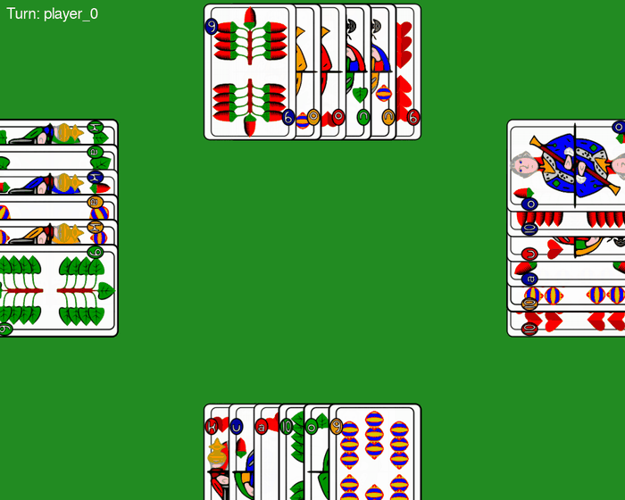

# MuckenEnv


**MuckenEnv** is a multi-agent reinforcement learning environment for the Bavarian card game "Mucken". It is based on the [PettingZoo](https://pettingzoo.farama.org/) AEC API (Agent Environment Cycle) and is optimized for training AI agents in a game with partial information.

## About the Game (Mucken)

Mucken is a traditional Bavarian card game for 4 people, similar to Schafkopf, but with simplified rules.

* **Players:** 4 agents (`player_0` to `player_3`).
* **Teams:** Fixed partnerships "crosswise" (Player 0 & 2 vs. Player 1 & 3).
* **Cards:** 24 cards (Acorns, Leaves, Hearts, Bells; ranks A, 10, K, O, U, 9).
* **Goal:** The team must collect more points through tricks than the opposing team.
* **Trumps:** Ober, Unter, and all Heart cards.



## Installation

Clone the repository and install it in "editable" mode (recommended for development):

```
git clone https://github.com/NicoEberlein/mucken-env.git
cd mucken-env
pip install -e .
```

Or install it directly from github:

```
pip install git+https://github.com/NicoEberlein/mucken-env.git
```

## Usage (Quickstart)

The environment uses the PettingZoo AEC API, where agents act sequentially (`agent_iter`).
See `game.py` in the examples for a working game loop with random agents.

## Environment Specifications

### Action Space

The Action Space is `Discrete(24)`. Each integer ID corresponds to a specific card.
A mapping of IDs to cards (e.g., `0` = Bells 9) is implemented in the code.

**Important:** The game requires players to **follow suit**. The environment provides an `action_mask` in the observation. Agents *must* use this mask, as playing an invalid card leads to immediate termination of the episode and a negative reward.

### Observation Space

The observation is a `Dict` space containing both raw data and **engineered features** to accelerate training.

> [!NOTE]
> **Work in Progress:** A detailed explanation of the observation space will follow

### Rewards

The environment uses a **hybrid reward system** (dense + sparse) to solve the credit assignment problem:

1.  **Intermediate Rewards:** After each round, the winners of the trick receive points based on the card values (normalized). The losing team receives the negative value (zero-sum).
2.  **Final Reward:** At the end of the game (after 6 rounds), the overall victory is evaluated. The winning team receives a significant bonus (+ game score), the losing team a penalty.

## File Structure

```
mucken-env/
├── mucken_env/
│   ├── cards/           # Card logic and strategies for each game type
│   ├── envs/            # The main Environment class
│   └── ...
├── tests/               # Unit tests for rules and API compliance
├── pyproject.toml       # Dependencies and package config
└── README.md
```

## License

### Code

This project is published under the **MIT License**. See [LICENSE](LICENSE) for details.

### Game Assets (Card Images)

The playing card images used in this project are based on the **XSkat** card set (German/Bavarian pattern).

**Original author:** Gunter Gerhardt, CC BY-SA 3.0 <https://creativecommons.org/licenses/by-sa/3.0>, via Wikimedia Commons

**Modifications made:**
The original images were converted to PNG format, resized, and renamed to match the technical requirements of the MuckenEnv environment.
